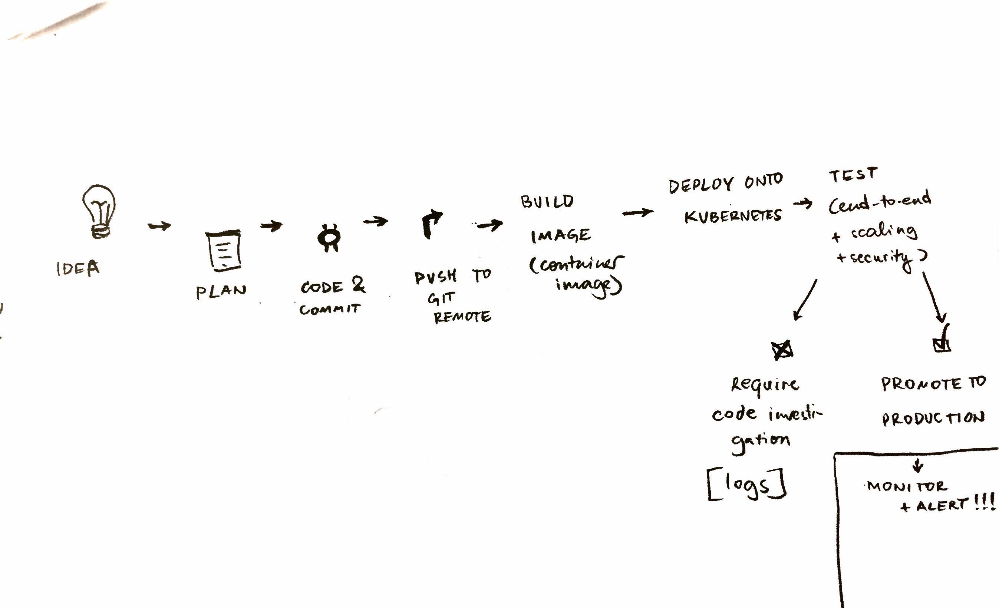

# Business value of DevOps

This article highlights the value of DevOps for businesses, Q&A-style.

## Question: what problems do enterprises face that DevOps can solve?

- Communication problems between developers ("hm, works on my laptop")
- Inability to quickly go from commit to release
- Problems with reliability in production: lack of scalability, frequent downtime, slow response times
- Late responses to problems in production

## Task: draw a diagram for the whole DevOps process

## Task: describe the process of a software release, step-by-step

1. Idea

2. Plan

3. Code, commit, push to feature-branch

4. Pipeline:
    - build
    - deploy
    - test end-to-end

6. When happy, merge pull request into master, then run pipeline:
    - build
    - deploy
    - test end-to-end

7. Monitor and respond to alerts when necessary.

## Question: who's responsibility is each step?

Steps 4 and 5 are done via a CI pipeline.

Other steps are done by humans, such as marketing people or engineering people.

## Question: what's the point of DevOps?

With DevOps, we get:

- Increased deployment frequency (feature / hotfix releases)
- Reliable releases that never fail in production

Business value:

- Happy application developers
- Less time (on payroll) spent on fixing and maintaining things
- Happy end customers (requested features and fixes get delivered quicker and reliably)
- No PR blunders due to security issues

## Up next

[Developer experience: from idea to push](/development)
